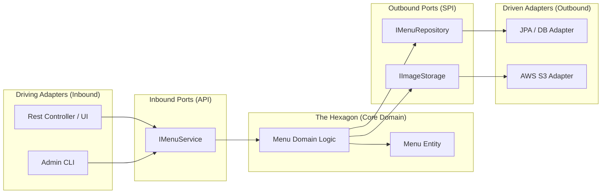

# Menu Management System - Hexagonal Architecture Blueprint

이 문서는 향후 **MSA(Microservices Architecture)**로의 전환을 대비하여, 메뉴 관리 시스템을 **헥사고날 아키텍처(Hexagonal Architecture / Ports and Adapters)**로 재설계하기 위한 청사진입니다.

## 🎯 왜 헥사고날인가?

1.  **MSA 전환 용이성**: 비즈니스 로직(내부)이 외부 기술(DB, 프레임워크)과 완전히 분리되어 있어, 향후 이 서비스만 별도 마이크로서비스로 분리하기 매우 쉽습니다.
2.  **기술 독립성**: DB가 MySQL에서 MongoDB로 바뀌거나, REST 대신 gRPC를 사용하게 되어도 핵심 비즈니스 로직은 수정할 필요가 없습니다.
3.  **테스트 최적화**: 어댑터 없이 '포트'를 통해서만 테스트를 수행할 수 있어 단위 테스트가 매우 빠르고 정확합니다.

## 🏗 아키텍처 다이어그램



## 📂 디렉토리 구조 (Backend 예시)

```text
backend/src/main/java/com/new_cafe/app/menu/
├── domain/                  # 최내곽: 비즈니스 핵심 (순수 Java)
│   ├── model/               # Menu 엔티티, Value Objects
│   └── service/             # 비즈니스 로직 구현 (Domain Services)
├── application/             # 응용 계층
│   └── port/                # 포트 정의
│       ├── in/              # 입력 포트 (User Cases / IMenuService)
│       └── out/             # 출력 포트 (SPI / IMenuRepository)
├── adapter/                 # 어댑터 계층 (세부 구현)
│   ├── in/                  # 입력 어댑터
│   │   └── web/             # MenuController, DTOs
│   └── out/                 # 출력 어댑터
│       ├── persistence/     # JPA 구현체, Entity(DB), Spring Data Repo
│       └── storage/         # 이미지 저장 파일 시스템/S3 구현체
└── MenuApplication.java
```

## 🛠 주요 설계 원칙

1.  **의존성 역전 (DIP)**: `adapter`는 `port`에 의존하지만, `domain`은 `adapter`를 전혀 모릅니다.
2.  **데이터 분리**: DB용 엔티티(JPA)와 도메인 엔티티(Pure Object)를 엄격히 분리하여 `adapter.out.persistence`에서 변환합니다.
3.  **포트를 통한 소통**: 외부에서의 모든 진입은 `inbound port`를 거치며, 외부 시스템으로의 모든 호출은 `outbound port`를 거칩니다.

## 🚀 MSA로 가는 길

이렇게 설계된 메뉴 관리 시스템은 하나의 **바운디드 컨텍스트(Bounded Context)**가 됩니다. 추후 이 폴더 전체를 떼어내어 별도의 프로젝트로 만들고, `adapter.in.web`을 API Gateway로 연결하고 `adapter.out`을 독립된 DB로 연결하는 것만으로 완벽한 마이크로서비스가 완성됩니다.

이 청사진대로 메뉴 관리 시스템부터 리팩토링을 시작할까요?
