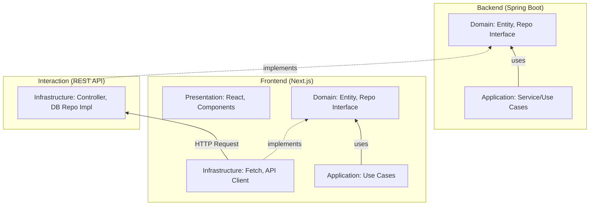

# N-Cafe System-Wide Clean Architecture Blueprint

본 문서는 N-Cafe 프로젝트의 백엔드(Spring Boot)와 프론트엔드(Next.js) 전체를 관통하는 **클린 아키텍처(Clean Architecture)** 설계 지침입니다.

## 🏗 전체 시스템 아키텍처 (Full-Stack)

모든 데이터의 흐름은 외부(Web, DB, API)에서 내부(Domain)로 향하며, 핵심 비즈니스 로직은 외부 기술 스택의 변경으로부터 보호받아야 합니다.



## � 핵심 계층 구조 요약 (Text Overview)

```text
==============================================================
[ FRONTEND (Next.js) ]
  |-- 1. Domain Layer: Entities, Repo Interfaces (DIP)
  |-- 2. Application Layer: Use Cases, DTOs
  |-- 3. Infrastructure Layer: API Clients, Repo Impls, Mappers
  |-- 4. Presentation Layer: ViewModels(Hooks), Components
==============================================================
             ▲ HTTP / REST API (The Bridge) ▲
==============================================================
[ BACKEND (Spring Boot) ]
  |-- 1. Domain Layer: Entities (POJO), Repo Interfaces
  |-- 2. Application Layer: Services (Use Cases)
  |-- 3. Infrastructure Layer: Controllers, DB Repos (JPA), DTOs
==============================================================
```

## �📂 통합 디렉토리 구조 및 계층별 역할

### 1. Backend (Spring Boot) - Enterprise Rules
*   **Domain Layer (`backend/.../entity`, `repository`)**:
    *   `Entity`: DB 스키마와 무관한 순수 비즈니스 객체입니다.
    *   `Repository Interface`: 기술 지향적인 JPA/MyBatis 대신 순수 인터페이스를 정의합니다.
*   **Application Layer (`backend/.../service`)**:
    *   `Use Case`: 비즈니스 시나리오(예: 메뉴 등록 승인 로직 등)를 구현합니다.
*   **Infrastructure/Adapter Layer (`backend/.../controller`, `dto`)**:
    *   외부 요청(HTTP)을 받아 응용 계층으로 전달하고, 데이터를 처리하여 반환합니다.

### 2. Frontend (Next.js) - Interface Adapters & UI
*   **Domain Layer (`frontend/src/domain`)**:
    *   `Entities`: 프론트엔드에서 다루는 메뉴, 카테고리 기저 모델입니다.
    *   `Repository Interfaces`: 데이터가 API에서 오는지 Local Storage에서 오는지 상관없이 규약만 정의합니다.
*   **Application Layer (`frontend/src/application`)**:
    *   `Use Cases`: 사용자의 액션(예: 메뉴 필터링, 검색 요청) 흐름을 관리합니다.
*   **Infrastructure Layer (`frontend/src/infrastructure`)**:
    *   **핵심**: Backend API와의 통신(`fetch`), DTO 변환(`Mapper`), API 구현체(`Repo Impl`)가 존재합니다.
*   **Presentation Layer (`frontend/src/presentation`, `app/`)**:
    *   React 컴포넌트와 비즈니스 상태를 UI에 바인딩하는 `ViewModel(Hooks)`입니다.

## 🛠 인프라스트럭처(Infrastructure) 계층의 중요성 (DIP)

백엔드와 프론트엔드 모두 **인프라 계층**은 "세부 사항(Detail)"입니다.
*   백엔드에서 DB를 MySQL에서 PostgreSQL로 바꿔도 **도메인 엔티티는 바뀌지 않습니다.**
*   프론트엔드에서 API 엔드포인트 구조나 통신 라이브러리(fetch -> axios)를 바꿔도 **유즈케이스와 도메인은 그대로 유지됩니다.**

---

## 🚀 향후 로드맵
1.  **Frontend `src/` 구축**: 현재 `app/` 하위에 흩어진 로직들을 `domain`, `application`, `infrastructure`로 이관합니다.
2.  **Backend 리팩토링**: 현재 `controller`와 `service` 사이의 강결합을 인터페이스 기반의 DIP 구조로 더욱 견고히 합니다.
3.  **Cross-Cutting Concerns**: 로깅, 에러 핸들링, 보안(JWT) 로직을 각 아키텍처의 의존성 규칙에 맞게 배치합니다.

이 청사진은 N-Cafe 시스템이 기술적 부채 없이 수년간 지속 가능하도록 설계되었습니다.

---

**이 구조로 변경하면 얻는 이점:**
1. **유지보수**: 백엔드 API 주소나 데이터 형식이 바뀌어도 `Infrastructure` 계층의 Mapper만 수정하면 됩니다.
2. **테스트**: UI 없이도 비즈니스 로직(Use Case)만 완벽하게 테스트할 수 있습니다.
3. **확장성**: 추후 다른 도메인(주문, 사용자 등)이 추가되어도 동일한 패턴으로 확장이 쉽습니다.

구조에 대해 승인해주시면, 순차적으로 `src/` 디렉토리를 구성하고 코드를 이관하도록 하겠습니다.
